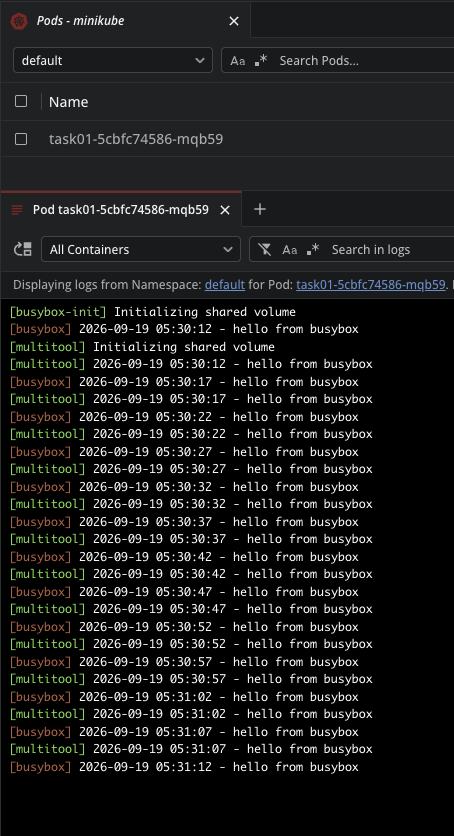
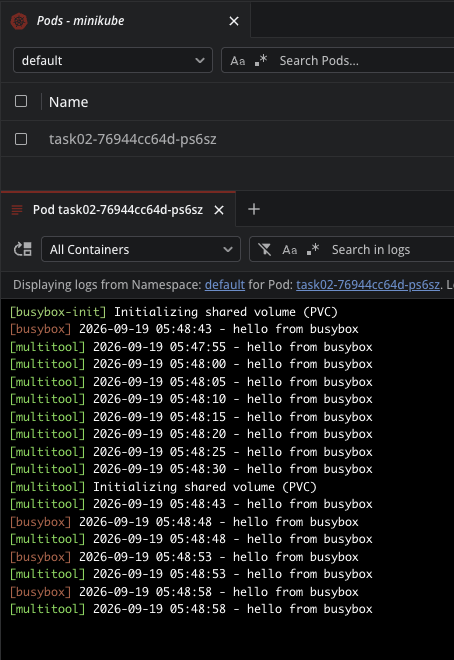
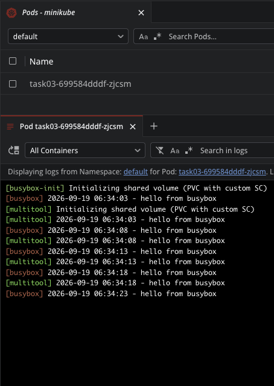

# Solution 03

## Task 01

* Deployment - `src-01/deployment.yaml`
* Result:

    

## Task 02

* Manifests - `src-02/manifests.yaml`
* Results:

    

* Logs:

    ```sh
    azabelin@ess-fearless 03 % k apply -f src-02
    persistentvolume/task02 created
    persistentvolumeclaim/task02 created
    deployment.apps/task02 created
    azabelin@ess-fearless 03 % k get all -n default
    NAME                          READY   STATUS    RESTARTS   AGE
    pod/task02-76944cc64d-ps6sz   2/2     Running   0          62s

    NAME                 TYPE        CLUSTER-IP   EXTERNAL-IP   PORT(S)   AGE
    service/kubernetes   ClusterIP   10.96.0.1    <none>        443/TCP   48m

    NAME                     READY   UP-TO-DATE   AVAILABLE   AGE
    deployment.apps/task02   1/1     1            1           62s

    NAME                                DESIRED   CURRENT   READY   AGE
    replicaset.apps/task02-76944cc64d   1         1         1       62s
    azabelin@ess-fearless 03 % k get pvc,pv -n default
    NAME                           STATUS   VOLUME   CAPACITY   ACCESS MODES   STORAGECLASS   VOLUMEATTRIBUTESCLASS   AGE
    persistentvolumeclaim/task02   Bound    task02   1Gi        RWO            standard       <unset>                 76s

    NAME                      CAPACITY   ACCESS MODES   RECLAIM POLICY   STATUS   CLAIM            STORAGECLASS   VOLUMEATTRIBUTESCLASS   REASON   AGE
    persistentvolume/task02   1Gi        RWO            Retain           Bound    default/task02   standard       <unset>                          76s
    azabelin@ess-fearless 03 % k delete deployment/task02
    deployment.apps "task02" deleted from default namespace
    azabelin@ess-fearless 03 % k delete pvc/task02       
    persistentvolumeclaim "task02" deleted from default namespace
    azabelin@ess-fearless 03 % minikube ssh head /data/task02/output.txt
    Initializing shared volume (PVC)
    2026-09-19 05:47:55 - hello from busybox
    2026-09-19 05:48:00 - hello from busybox
    2026-09-19 05:48:05 - hello from busybox
    2026-09-19 05:48:10 - hello from busybox
    2026-09-19 05:48:15 - hello from busybox
    2026-09-19 05:48:20 - hello from busybox
    2026-09-19 05:48:25 - hello from busybox
    2026-09-19 05:48:30 - hello from busybox
    azabelin@ess-fearless 03 % k get pv
    NAME     CAPACITY   ACCESS MODES   RECLAIM POLICY   STATUS     CLAIM            STORAGECLASS   VOLUMEATTRIBUTESCLASS   REASON   AGE
    task02   1Gi        RWO            Retain           Released   default/task02   standard       <unset>                          6m36s
    azabelin@ess-fearless 03 % k delete pv/task02                          
    persistentvolume "task02" deleted
    azabelin@ess-fearless 03 % minikube ssh 'ls -lahi /data/task02/output.txt'
    1619881 -rw-r--r-- 1 root root 1.9K Sep 19 05:51 /data/task02/output.txt
    azabelin@ess-fearless 03 % 
    ```

* **Note**: After deleting the `Deployment` and `PVC`, the `PV` moved to `Released` because of its reclaim policy (in manifest: `persistentVolumeReclaimPolicy: Retain`). K8s keeps the volume and its data and does not clean it up.
* **Note**: After deleting the `PV`, the file on the K8s node was not deleted. `PV` is just an object in K8s (a description of a volume), not the data itself. The `PV` was created manually with reclaim policy `Retain`, Kubernetes does nothing with data upon `PV` deletion, so the file must be deleted manually.

## Task 03

* Manifests - `src-03/manifests.yaml`
* Result:

    

* Logs:

    ```sh
    azabelin@ess-fearless 03 % k apply -f src-03 
    storageclass.storage.k8s.io/task03 created
    persistentvolumeclaim/task03 created
    deployment.apps/task03 created
    azabelin@ess-fearless 03 % k get sc,pvc,pv
    NAME                                             PROVISIONER                RECLAIMPOLICY   VOLUMEBINDINGMODE   ALLOWVOLUMEEXPANSION   AGE
    storageclass.storage.k8s.io/standard (default)   k8s.io/minikube-hostpath   Delete          Immediate           false                  93m
    storageclass.storage.k8s.io/task03               k8s.io/minikube-hostpath   Delete          Immediate           false                  42s

    NAME                           STATUS   VOLUME                                     CAPACITY   ACCESS MODES   STORAGECLASS   VOLUMEATTRIBUTESCLASS   AGE
    persistentvolumeclaim/task03   Bound    pvc-87c2a063-aaca-4345-9f27-18f87ed105d2   1Gi        RWO            task03         <unset>                 42s

    NAME                                                        CAPACITY   ACCESS MODES   RECLAIM POLICY   STATUS   CLAIM            STORAGECLASS   VOLUMEATTRIBUTESCLASS   REASON   AGE
    persistentvolume/pvc-87c2a063-aaca-4345-9f27-18f87ed105d2   1Gi        RWO            Delete           Bound    default/task03   task03         <unset>                          42s
    azabelin@ess-fearless 03 % k get pod
    NAME                      READY   STATUS    RESTARTS   AGE
    task03-699584dddf-zjcsm   2/2     Running   0          2m52s
    azabelin@ess-fearless 03 % 
    ```
